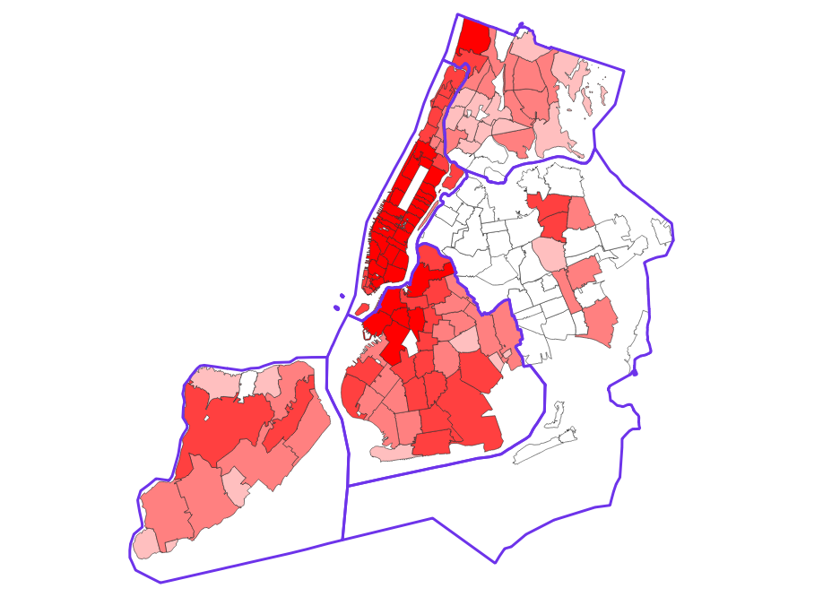

# 2016 Democratic Primary Contribution Analysis

## Summary

This analysis examines individual-level campaign contributions during the 2016 Democratic primaries. The focus is both national and hyperlocal (New York City), particularly the potential impact of Brooklyn’s controversial 120,000+ voter purge on Bernie Sanders and Hillary Clinton delegate count outcome.

## Key Questions

1. How was ActBlue categorized within FEC records?
1. Is there a geographical correlation between contributions and vote shares?
1. How were contributions distributed across NYC boroughs?
1. Could the Brooklyn ballot purge have influenced the delegate outcome?

## *Step-by-Step Process*

### Step 1: *Download and Clean FEC Data*

* Files used:
  * `cn.txt`  → Candidate Master
  * `itcont.txt`  →  Individual Contributions
* Python Script: [1st_pkg16.py](1st_pkg16.py)
* Outputs:
  * `USA.pkl`, `USA-sample.pkl`, `nys.pkl`, `nyc.pkl`

### Step 2: *Download Census Geographic Shapefiles*

* Files used:
  * `cb_2019_us_state_500k.zip`  → Census State Shapefile
  * `cb_2019_us_zcta510_500k.zip`  → Census Zip Shapefile
* Python Script: [altogether16.py](altogether16.py)
* What it does:
  * Merges contribution data with state and zip code shapefiles
  * Generates `byzip.csv` and `USA_Primaries.gpkg` for spatial analysis
* Outputs:
  * `byzip.csv`, `USA_Primaries.gpkg`, `ByZip_Trim.gpkg`

### Step 3: *NYC Zip Code Refinement*

* Files used:
  * `tl_2016_us_zcta510.zip`, `tl_2016_us_county.zip`
* Python Script: [16nymaps.py](16nymaps.py)
* What it does:
  * Filters out only NYC zip codes for focused mapping
* Output:
  * `nyc-zips.gpkg`

### Step 4: *Final Visual Output*

* Use `ByZip_Trim.gpkg` to layer contributions over geographic regions using QGIS
* Final visualization of individual contributors to Bernie Sanders (in green) and Hillary Clinton (in yellow) in relation to the contributors' zipcode in the respective boroughs of New York City:
  * Figure 1: Bernie Sanders vs. Hillary Clinton
  
  * Figure 2: Hillary Clinton financial contributions
  
  * Figure 3: Hillary (yellow) to Bernie (green) financial contributions overlayed on Bernie Sanders financial contributions by zip code
  

## Notes

* *Python libraries used:* `pandas`, `geopandas`, and `matplotlib`.
* Date filters ensure analysis only includes contributions made before the June 8, 2016 primary date  → when Bernie suspended his campaign.
* Other figures were made in QGIS using the same geopackages.
