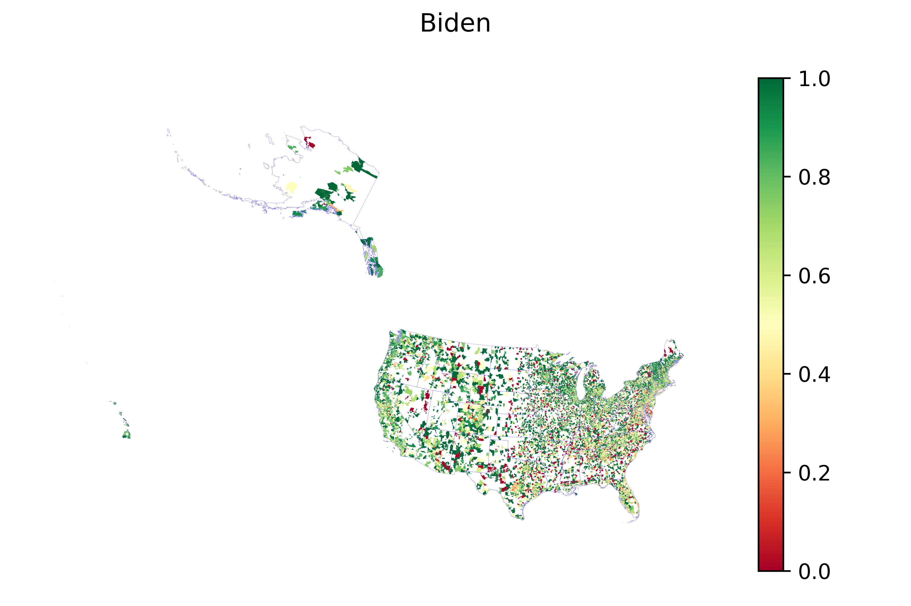

# 2020 Democratic Primary Contribution Analysis

## Summary

This analysis explores campaign contributions during the 2020 Democratic primary season, focusing on five major candidates: Bernie Sanders, Joe Biden, Elizabeth Warren, Kamala Harris, and Pete Buttigieg. It aims to examine overall patterns at individual-level contributions, and provide comparative visualizations of donors across the country.

## Key Questions

* How did contributions differ between the major 2020 Democratic candidates?
* What trends can be seen in geographic contribution patterns at the ZIP code level?
* What does the contribution data reveal about grassroots support and donor behavior?
* How is ActBlue reflected in FEC’s individual contributions dataset in 2020?

## *Step-by-Step Process*

### Step 1: *Download and Filter FEC Contribution Data*

* Files Used:
  * `cn.txt` (Candidate master file) with `cn_header_file.csv`
  * `indiv20/itcont.txt` (Individual contributions file) with `indiv_header_file.csv`

* Python Script: `scripts/1st_pkg20.py`

* What the Script Does:
  * Loads candidate metadata and filters for five key Democratic candidates
  * Loads 2020 individual contribution data and strips to relevant columns
  * Outputs full and sample datasets in pickle format

* Script Outputs:
  * `USA.zip`
  * `USA-sample.pkl`

---

### Step 2: *Clean, Filter, and Tag Contributions*

* Python Script: `scripts/altogether20.py`

* What the Script Does:
  * Filters contribution records for valid dates (2019–April 7, 2020)
  * Removes refunds and in-kind donations
  * Identifies and tags contributions by candidate
  * Aggregates contribution metrics at the individual and ZIP code levels
  * Merges ZIP-level data with geospatial files to prepare for mapping

* Script Output:
  * `byzip.zip`
  * `USA_primaries.gpkg` (Geopackage for map visualizations)

---

### Step 3: *Generate National Visualizations*

* Python Script: `scripts/plotting20.py`

* What the Script Does:
  * Figures show ratio of individuals contributing to Bernie divided by individuals numbers closer to 1, indicated in green, means most or all f with other leading presidential candidates Loads geospatial contribution data and plots ZIP-code-level maps for:
    * Figure 1: Bernie
    * 
    * 
    * Bernie vs. Warren (`ratio_BW`)
    * Bernie vs. Pete (`ratio_PB`)
    * Bernie vs. Entire Field (`ratio_all`)
  * Creates bar plots comparing:
    * Total number of individual contributors
    * Total number of contributions
    * Total amount contributed per candidate

* Script Outputs:
  * ``
  * ``
  * `2020_Dem_PrimariesBW.png`
  * `2020_Dem_PrimariesPB.png`
  * `2020_Dem_Primariesall.png`
  * `fig_indi.png`
  * `fig_count.png`
  * `fig_amt.png`

---

## *Reproducing the Results*

To reproduce this analysis:

1. Download the required FEC data (`cn.txt`, `itcont.txt`) and census shapefiles.
2. Ensure `cn_header_file.csv` and `indiv_header_file.csv` match the FEC data format.
3. Run scripts in the following order:
   * `1st_pkg20.py` → saves raw and sample data
   * `altogether20.py` → filters, tags, and processes contributions into geospatial form
   * `plotting20.py` → generates maps and summary visualizations

*Python libraries used:* `pandas`, `geopandas`, and `matplotlib`.

---

## *Notes*

* ActBlue contributions are captured under committee IDs and may include "OTHER_ID" references depending on routing.
* Mapping is conducted at the national level using 5-digit ZIP code regions, not local precincts or boroughs.
* Date filters ensure analysis only includes contributions made before the April 8, 2020 primary date–when Bernie suspended his campaign.
