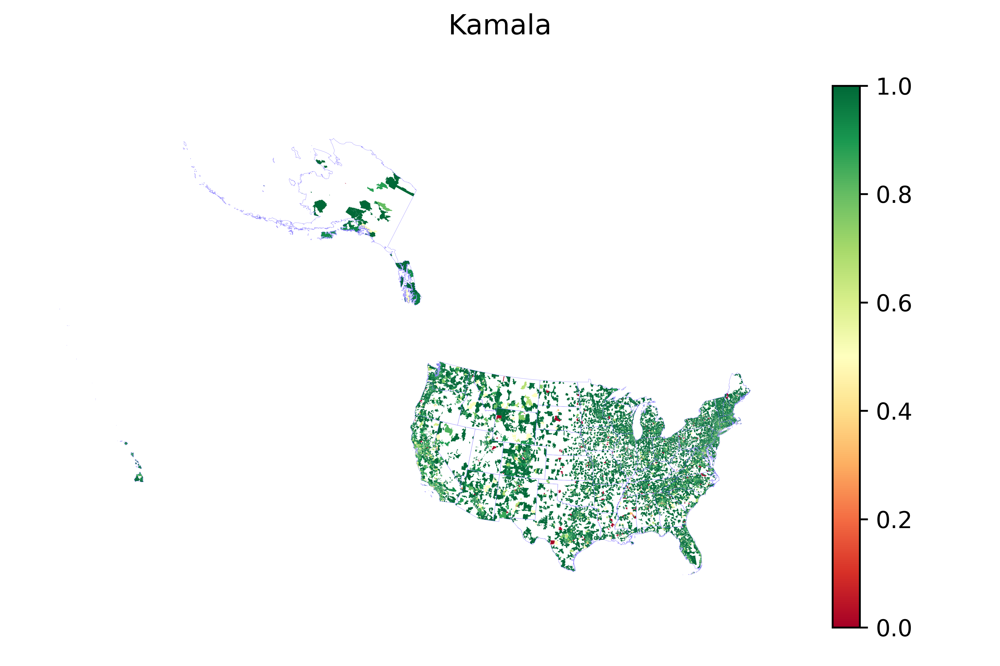
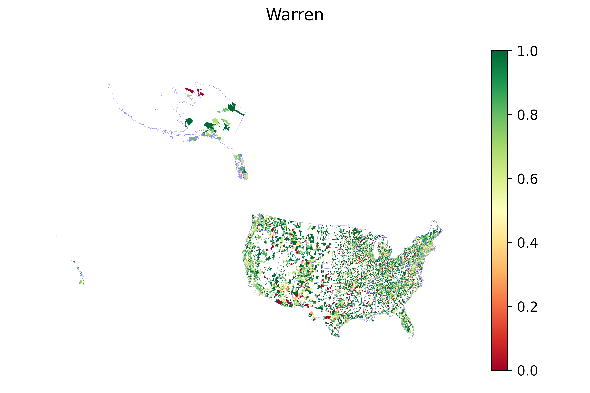
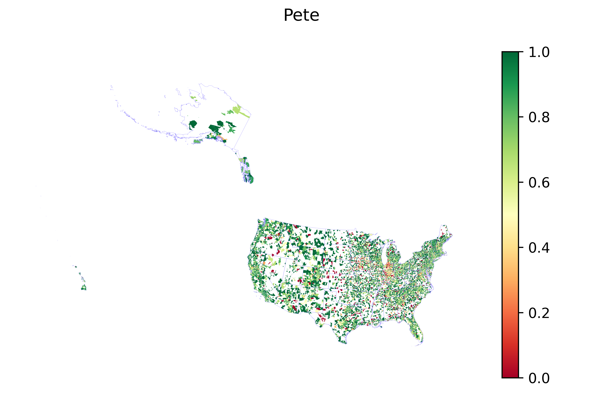
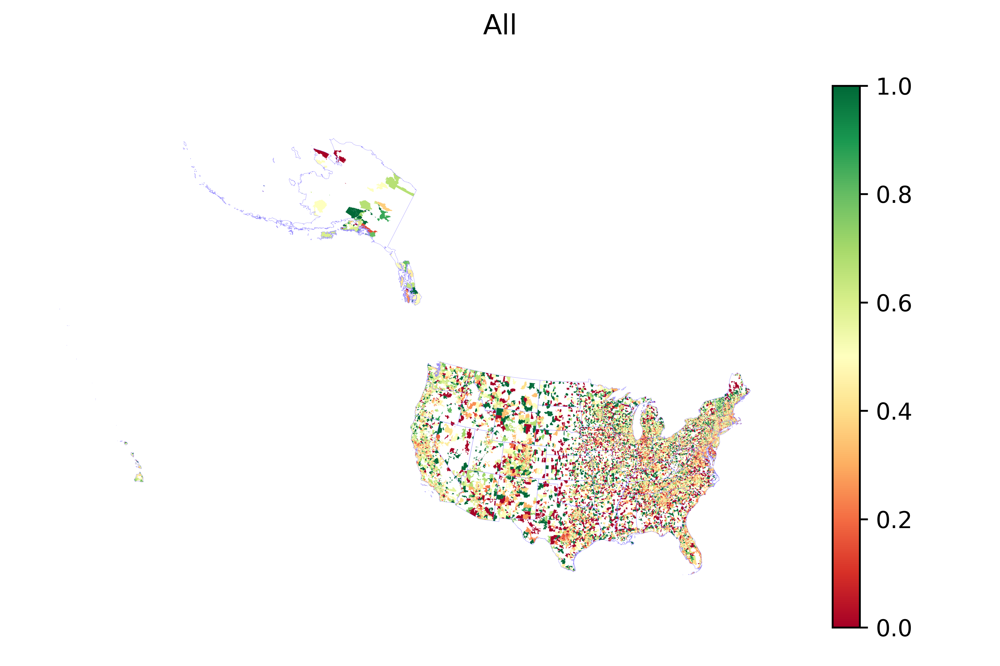
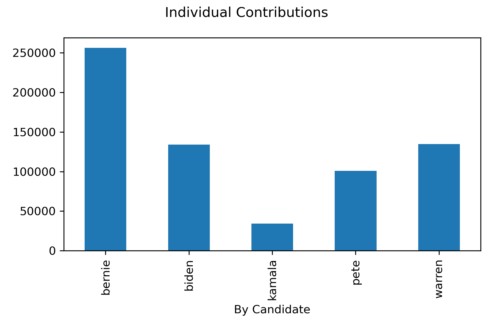
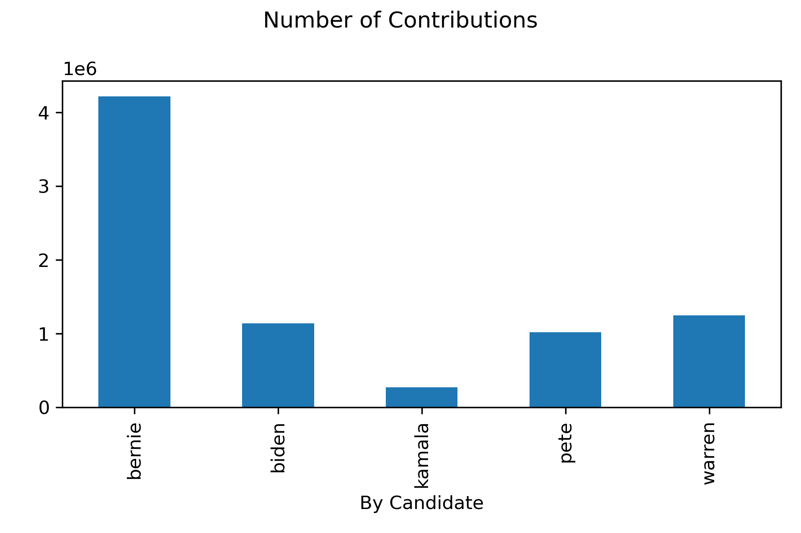
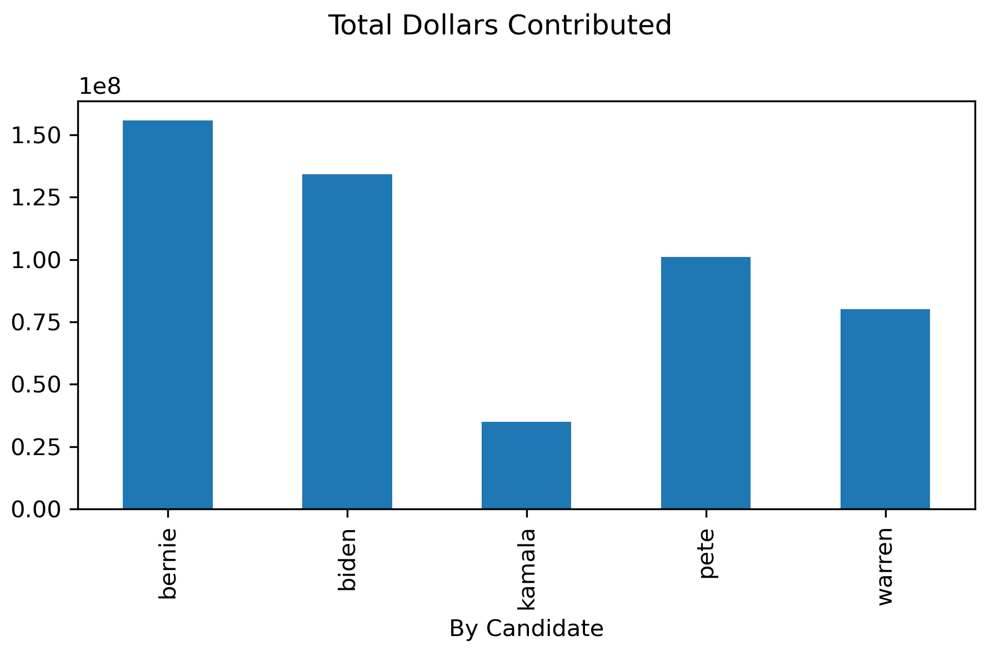

# 2020 Democratic Primary Contribution Analysis

## Summary

This analysis explores campaign contributions during the 2020 Democratic primary season, focusing on five major candidates: Bernie Sanders, Joe Biden, Elizabeth Warren, Kamala Harris, and Pete Buttigieg. It aims to examine overall patterns at individual-level contributions, and provide comparative visualizations of donors across the country.

## Key Questions

* How did contributions differ between the major 2020 Democratic candidates?
* What trends can be seen in geographic contribution patterns at the zip code level?
* What does the contribution data reveal about grassroots support and donor behavior?
* How is ActBlue reflected in FEC’s individual contributions dataset?

## *Step-by-Step Process*

### Step 1: *Download and Filter FEC Contribution Data*

* Files Used:
  * `cn.txt`  → Candidate Master with `cn_header_file.csv`
  * `indiv20/itcont.txt` → Individual contributions with `indiv_header_file.csv`

* Python Script: [1st_pkg20.py](1st_pkg20.py)

* What the Script Does:
  * Loads candidate metadata and filters for five key Democratic candidates
  * Loads 2020 individual contribution data and strips to relevant columns
  * Outputs full and sample datasets in pickle format

* Script Outputs:
  * `USA.zip` → use in Step 2
  * `USA-sample.pkl`

### Step 2: *Clean, Filter, and Tag Contributions*

* Python Script: [altogether20.py](altogether20.py)

* What the Script Does:
  * Filters contribution records for valid dates (2019–April 7, 2020)
  * Removes refunds and in-kind donations
  * Identifies and sorts contributions by candidate
  * Aggregates contribution metrics at the individual and zip code levels
  * Merges zipcode-level data with geospatial files to prepare for mapping

* Script Output:
  * `byzip.zip`
  * `USA_primaries.gpkg` → geopackage for map visualizations

### Step 3: *Generate National Visualizations*

* Python Script: [plotting20.py](plotting20.py)

* Visual Outputs:
  * The figures below show the ratio of individuals contributing to Bernie divided by individuals contributing to respective candidate. When the numbers are closer to 1, indicated in green, that means most or all individuals contributed to Bernie's campaign in that zipcode.
    * Figure 1: Bernie Sanders vs. Joe Biden
     
    * Figure 2: Bernie Sanders vs. Kamala Harris
     
    * Figure 3: Bernie Sanders vs. Elizabeth Warren
     
    * Figure 4: Bernie Sanders vs. Pete Buttigieg
     
    * Figure 5: Bernie Sanders vs. other four candidates
     
  * The bar charts below shows three different ratios:
    1. Total number of individual contributors to each presidential campaign
    
    1. Total number of contributions (suggesting people had monthly installments for candidate(s) or founds ways to donate multiple times over)
    
    1. Total dollar amount contributed per candidate (in millions USD)
    

## *Notes*

* *Python libraries used:* `pandas`, `geopandas`, and `matplotlib`.
* ActBlue contributions are captured under committee IDs and may include "OTHER_ID" references depending on routing.
* Mapping is conducted at the national level using 5-digit ZIP code regions, not local precincts or boroughs.
* Date filters ensure analysis only includes contributions made before the April 8, 2020 primary date–when Bernie suspended his campaign.
